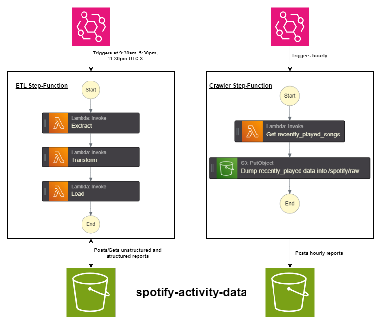

# Music Activity Data ETL

## ETL to keep record of my music activity from Spotify. Main goals of this project:
- Practice and learn about data engineering tools such as Airflow and AWS services related to this field.
- Monitor and visualize my music data.

## Things that came across the way
I realised that the Spotify endpoint to get [recently_played songs](https://developer.spotify.com/documentation/web-api/reference/get-recently-played) only gives the latest 50 songs, but doesn't let you go any further in time. This was not ideal, since I listen to way more than 50 songs in a single day.

## Solution
Reading about AWS services, I came across AWS: Step Functions.

Since the Spotify endpoint as it is doesn't really do what I want (get all my played songs), I decided to do two things:
- Setup an AWS: Step Function to trigger a Lambda function every 1 hour in order to get all my played songs and periodically dump them in a S3 bucket.
- Since my ETL is simple, I decided to make another Step Function to run it, composed of 3 Lambdas, one for each main function, **Extract**, **Transform** and **Load**. This Step Function runs daily.

So my project architecture looks like this:

## Data being tracked
The data being tracked can be divided into two main groups. The song general data and the sections data.
### Song General Data
This data represents general information about a song. Here are the features used here:
- **track_id**: ID of the track from Spotify's API.
- **track_name**: Title of the track.
- **track_artist**: Artist of the track.
-  **played_at**: Time at which the song was played.
-  **explicit**: Shows if the track has explicit lyrics or not.
-  **popularity**: Track popularity according to Spotify.
-  **album**: Name of the album the track belongs to.
-  **album_cover**: URL to the album's cover.
-  **album_cover_height**: Cover's height.
-  **album_cover_width**: Cover's width.
-  **duration**: Duration of the track in seconds.

The following data comes from the [Track's Audio Features](https://developer.spotify.com/documentation/web-api/reference/get-several-audio-features) endpoint, for more detail on each attribute, view the endpoint's documentation.

-  **loudness**: Overall loudness of the track in decibels.
-  **tempo**: Overall tempo of the track in beats per minute.
-  **key**: The key the track is in.
-  **time_signature**: Estimated time signature.
-  **mode**: The mode indicates the modality of the track (mayor or minor).
-  **acousticness**: Confidence value of wether the track is acoustic.
-  **danceability**: Describes how suitable the track is for dancing.
-  **energy**: Represents a perceptual measure of intensity and activity.
-  **instrumentalness**: Predicts whether a track contains no vocals.
-  **speechiness**: Detects the presence of spoken words in the track.
-  **valence**: Describes the musical positiveness conveyed by the track.

This features are calculated.
- **sections**: The number of sections the track is divided in.
- **sections_duration_avg**: The average duration of each section of the track.
- **loudness_avg**: The average loudness of the sections in the track.
- **tempo_avg**: The average tempo of the sections in the track.

### Sections data
According to Spotify: *Sections are defined by large variations in rhythm or timbre, e.g. chorus, verse, bridge, guitar solo, etc. Each section contains its own descriptions of tempo, key, mode, time_signature, and loudness.* This data is obtained from the [Track's Audio Analysis](https://developer.spotify.com/documentation/web-api/reference/get-audio-analysis) endpoint.

Since a song can have many sections, instead of representing them in an array of objects (like Spotify's API), they're represented in sequences of values.

- **start_sequence**: Contains the seconds at where each section starts.
- **loudness_sequence**: Contains the loudness of each section.
- **tempo_sequence**: Contains the tempo of each section.
- **key_sequence**: Contains the key of each section.
- **mode_sequence**: Contains the mode of seach section.
- **time_signature_sequence**: Contains the time signature of each section.

## Pivoting
The original idea of this project was to use the song characteristics I mentioned earlier, and by a hand-made dataset of similar songs, train a machine learning model that could decide if two songs sounded similar or not. This could be used in the future once this whole thing is working and I gather enough data, but I decided moving into simpler things (I believe) and go with this ETL idea.